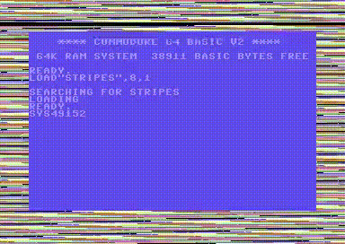

# Hello world

## Flickering border (before hello)

Before the canonical "Hello World" program, we'll start with a simpler one: flickering border.

.

To change the border color, set the color value at memory location $d020 (53280).

The [BASIC version](border-flicker.bas) is too slow to achieve the effect.

## Screen memory

This method is easy and fast. However, unlike `CHROUT` KERNAL call, it does not handle the cursor position.

⚠️ Use `!scr` instead of `!pet` as the screen memory does use the same codes. See [p. 22](https://www.unicode.org/L2/L2019/19025-terminals-prop.pdf).
